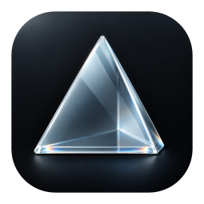

# Prisma

Per-app volume for macOS. A native mixer with menu bar controls, optional Chrome tab support, and an optional Stream Deck plugin.

[日本語](README.ja.md) · [Download the preview](https://github.com/kory-/prisma/releases/tag/v0.7.0) · [Report a bug](https://github.com/kory-/prisma/issues)

**Public preview · Apple Silicon · macOS 14.4+**

This early release is ad-hoc signed and **not notarized by Apple**. The minimum macOS target is 14.4; live playback has been tested on macOS 26.5.2 and 27.0, not every supported version. See [known limitations](docs/testing.md) before using it.

## Features

- Set each app's volume from 0–100%, or mute it.
- Adjust sound from a native window or the menu bar.
- Choose your system output device.
- Set login launch, startup audio behavior, appearance, Dock visibility, and menu options.
- Use Japanese or English; the app can follow your system language.
- Add **Prisma Tabs** to detect and adjust individual Chrome tabs automatically.
- Add **Prisma for Stream Deck** to control sound with keys or Stream Deck + dials, including app icons and automatic assignment of playing apps.

Prisma runs on its own. Chrome and Stream Deck are optional integrations. No virtual audio driver or administrator service is installed.

## Install

Install from the [Prisma Homebrew tap](https://github.com/kory-/homebrew-tap):

```sh
brew install --cask kory-/tap/prisma
```

Or download `Prisma-0.7.0-macOS-arm64.zip` from the [release page](https://github.com/kory-/prisma/releases/tag/v0.7.0), unzip it, and move `Prisma.app` to Applications. If switching from a manual installation to Homebrew, quit Prisma and move the old app out of Applications first; your saved settings are retained.

1. Open Prisma. This preview has no Developer ID signature or Apple notarization, including when installed with Homebrew. If macOS blocks it, follow [Apple's instructions for an app you trust](https://support.apple.com/en-us/102445), or [build from source](docs/development.md). Do not disable Gatekeeper globally.
2. Turn on volume control in the toolbar and allow system audio access when macOS asks.
3. Play audio and adjust the app's slider. Closing the window keeps Prisma in the menu bar by default.

For Homebrew updates, quit Prisma, then run:

```sh
brew update
brew upgrade --cask kory-/tap/prisma
```

To uninstall the Homebrew app, run `brew uninstall --cask kory-/tap/prisma`. Your preferences and separately installed Chrome and Stream Deck integrations are retained.

Settings are available from the gear button or **⌘,**. The output selector changes the Mac's default output device, rather than routing each app to a separate device.

| Optional download | Purpose |
| --- | --- |
| `io.github.kory-.prisma.streamDeckPlugin` | Double-click to install into Stream Deck. [Setup](docs/stream-deck.md) |
| `Prisma-Tabs-0.3.0.zip` | Chrome extension source. It is also bundled in the app. [Setup](docs/chrome.md) |
| `SHA256SUMS.txt` | Checksums for the attached release files |

## Privacy

Audio is processed in memory. Prisma does not save recordings, upload audio, or collect analytics. The Chrome extension sends detected tab titles, icons and playback state to Prisma on your Mac. [Privacy details](PRIVACY.md)

## Development

The app uses AppKit and Core Audio process taps. The Stream Deck plugin is written in Swift, and Prisma Tabs uses Chrome Manifest V3. Runtime dependencies are macOS frameworks and the optional host applications.

```sh
./build.command
./test.command
```

Building requires an Apple Silicon Mac, current Xcode or Command Line Tools, and Python 3. Tests also require Node.js. [Build, test and packaging instructions](docs/development.md) · [Contributing](CONTRIBUTING.md)

## Project

Created by [kory-](https://github.com/kory-). Prisma is an independent implementation; it does not include Background Music source code. It is not affiliated with Apple, Google, Elgato, or the unrelated Prisma ORM project.

[Changelog](CHANGELOG.md) · [Support](https://github.com/kory-/prisma/issues) · [Security](SECURITY.md)

Licensed under the [MIT License](LICENSE).
